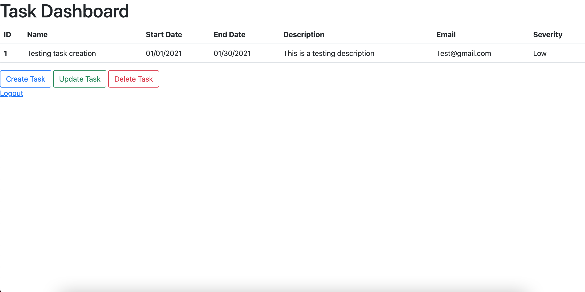

# Create a Task Manager Application

This Spring MVC web application allows user's to register and login into personal accounts and create, update, and delete their unique task records...

## Features

	- Bootstrap styling
	- Date picker and drop down menu for task attribute input
	- User can access, create, update, and delete account specific task records
	- Appropriate exceptions and errors are handled

## Installation

	- Clone and pull source code from provided github repository
	- Run the SpringApplication 

## Code

	https://github.com/nicholas-auyeung/Create-a-Task-Manager-Application

## Flow

1. Go to https://start.spring.io/

2. Enter the appropriate spring project settings:

	Project: Project
	Language: Java
	Spring Boot: 2.4.1
	Enter package names
	Packaging: Jar
	Java: 8

3. Enter the appropriate spring project dependencies:
	
	Spring Boot DevTools
	Lombok
	Spring Web
	MYSQL Driver
	Spring Data JPA

4. Import into Eclipse EE as maven project

5. Add additional maven dependencies, Swagger, Apache Tomcat, and JSTL

6. Define src/main/resources/application.properties with appropriate url/uri pattern prefix/suffix and database settings/credentials.

7. Create package layout, config, controller, dao, entity, exception, repository, and service pacakges.

8. Define appropriate entity classes, Task, User, and UserTask.

9. Define appropriate repository interfaces, TaskRepository, UserRepository, and UserTaskRepository interfaces extending CRUDRepository.

10. Define appropriate DAO interfaces, TaskDAO, UserDAO, UserTaskDAO with appropriate DAO functions.

11. Define appropriate DAOImpl classes, TaskDAOImpl, UserDAOImpl, and UserTaskDAOImpl classes.

12. Define appropriate service interfaces, TaskService, UserService, and UserTaskService with appropriate service functions.

13. Define appropriate service implement classes, TaskServiceImpl, UserServiceImpl, UserTaskService.

14. Define appropriate controllers, UserController and UserTaskController.

15. Create new folder directory under src/main --> src/main/webapp/WEB-INF-views.

16. Define appropriate jsp pages.

17. Inside UserController implement registration.

18. Inside UserController implement login.

19. Inside UserController implement logout.

20. Inside TaskController implement table to view tasks.

21. Inside TaskController implement add tasks function.

22. Inside TaskController implement delete tasks function.

23. Inside TaskController implement update tasks function.

24. Define custom exception, InvalidCRUDRepException.

25. Throw and catch custom exception in application.

24. Define Swagger configuration file, SwaggerConfig.

25. Implement BootStrap and JSTL on all jsp pages.

26. Implement JQuery on some jsp pages.

## Usage
Once run, navigate to localhost:8080/register on a web browser.
	
	The enter register page will appear prompting the user for credentials.

	Clicking the 'Already have an account? Login here' hyperlink will bring you to the login page if user already has account.

	
	Once registered or logged in the user will be redirect to the dashboard page, displaying all current tasks.

	After clicking 'Add Task' User can then add a task with their desired details.

	Once added user will be redirected to dashboard page, displaying all current tasks.

	User can add multiple tasks and all will be displayed on the dashboard.

	After clicking 'Update Task' User can enter task ID of desired task to update.

	If task ID is valid, user will be redirected to an edit task form page.

	
	After task update has been successful user will be brough back to dashboard page displaying all current tasks.

	After clicking 'Delete Task' User can enter task ID of desired task to update.

	If task delete has been successful user will be brough back to dashboard page displaying all current tasks.

